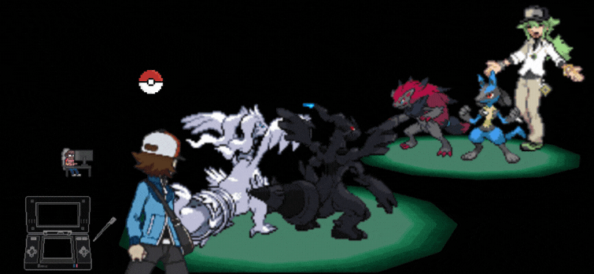

 

# こんにちは!   

## 🧠 About Me  
- 🚀 Currently working on **ViTs, VAEs, LLMs/SLMs, Zero-Knowledge Machine Learning, Distributed & Federated Learning, Data-Centric AI, Machine Unlearning**  
- 🔬 Focused on **AI in Blockchain & Healthcare, Human-Interaction AI, AGI, Data & Learning Optimization in ML**

---

## 📬 Reach Me At  
- 📧 **Mail**: rsjoshi0505@gmail.com  
- 💼 **LinkedIn**: [rudraksh-sachin-joshi](https://www.linkedin.com/in/rudraksh-sachin-joshi-75554b202/)  

---

## 🚀 My Skills

### 🖥️ Programming Languages

### 🏗️ Frameworks & Libraries

### 🗄️ Databases

### ☁️ DevOps & Cloud

### 🛠️ Tools, Platforms & Technologies

---